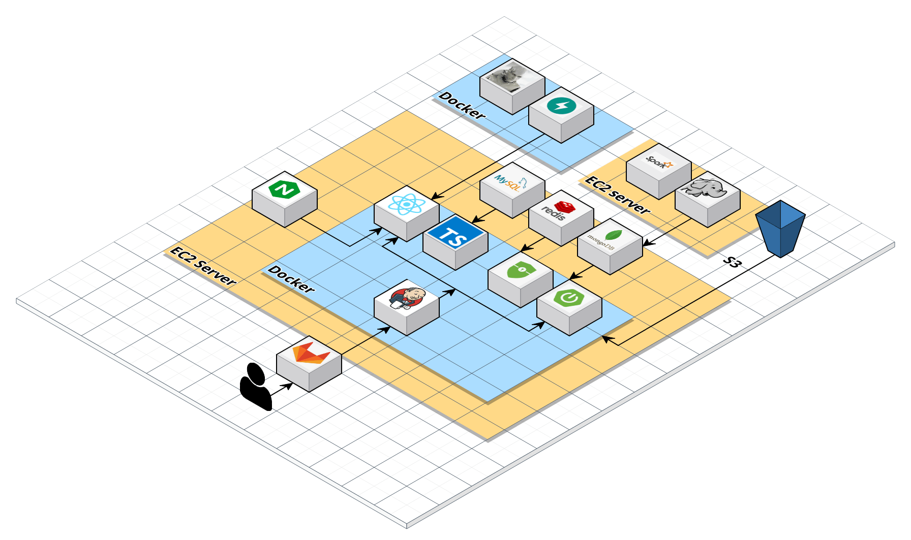

# Style Finder

## 🌟 서비스 소개

"Style Finder"는 개인의 취향과 체형, 최신 패션 트렌드를 고려하여 맞춤형 의류 스타일을 추천해주는 온라인 플랫폼입니다. 사용자가 입력하는 기본 정보와 선호도를 바탕으로, AI 기반 알고리즘이 최적의 의상 조합을 제안함으로써, 매일 아침 '오늘 뭐 입지?'의 고민에서 벗어날 수 있도록 돕습니다.

<br />

## 🎨 핵심 기능

**개인별 맞춤 스타일 추천**: 선호하는 색상 및 스타일 등을 고려하여 개인에게 어울리는 의류를 추천합니다.

**패션 트렌드 분석**: 최신 패션 트렌드 데이터를 분석하여, 사용자가 패션에 뒤처지지 않도록 도와줍니다.

**커뮤니티 피드**: 사용자들이 자신의 스타일을 공유하고, 다른 사용자들의 스타일을 참고할 수 있는 소셜 피드 기능을 제공합니다.

<br />

## 🛠️ 개발 환경

### Front-end

- Visual Studio Code
- React 18.2.0
- Node.js 20.10.0
- TypeScript
- Tailwind CSS

### Back-end

- IntelliJ
- SpringBoot 3.2.1
- spring-boot-jpa
- spring security 6.1.3
- OpenJDK 17
- MySQL 8.3.0
- MongoDB 7.0.7
- Redis

### AI

- PyCharm
- MobaXterm
- python 3.10.0
- FastAPI 0.110.0
- uvicorn 0.29.0
- Pytorch 2.2.1

### Data

- VSCode
- MobaXterm
- python 3.8.10
- java 11.0.22
- FastAPI 0.110.0
- uvicorn 0.29.0
- hadoop 3.3.6
- pyspark 3.5.1

### Infra

- MobaXterm
- Docker
- Jenkins 2.426.2
- AWS S3
- AWS EC2 Ubuntu 20.04.6 LTS (GNU/Linux 5.15.0-1051-aws x86_64)
- Nginx 1.24.0

### 협업 툴

- Git
- Jira
- Notion
- Mattermost
- Figma

## 🎉 기술 특이점

### 1. 고성능 데이터 처리 아키텍처

```
Hadoop과 Spark를 이용해 대규모 패션 관련 데이터를 효과적으로 처리하고 분석합니다. 이를 통해 사용자와 패션 아이템 간의 복잡한 관계를 파악할 수 있습니다.
```

### 2. 사용자 경험 중심의 프론트엔드 설계

```
React와 Tailwind CSS를 활용하여 사용자 친화적이고 직관적인 인터페이스를 설계합니다. 사용의 용이성과 함께 시각적 매력을 극대화하여 사용자 경험을 향상시킵니다.
```

### 3. 안정성과 보안을 고려한 백엔드 구축

```
SpringBoot를 기반으로 RESTful API를 구축하고, Spring Security를 통해 사용자 데이터와 시스템의 보안을 강화합니다.
```

### 4. 지속적인 통합 및 배포 환경

```
Docker를 사용하여 개발 환경의 일관성을 보장하고, Jenkins를 통해 자동화된 지속적 통합(CI) 및 지속적 배포(CD) 파이프라인을 구축합니다.
```

### 5. 협업과 효율성 강화를 위한 개발 프로세스

```
체계적인 브랜치 관리와 개발 프로세스를 위해 Git Flow 전략을 채택합니다.
```
<br />

## 🎨 Git Flow 전략

- master : 배포

- develop : 개발 및 테스트

- feature : 기능

<br>

- git branch 작성 예시
```
FE/domain/feature
BE/domain/feature
```

<br>

- 개발 시, 맡은 기능 별로 develop 하위에 feature 브랜치 생성

- 개발 완료 시, 해당 feature 브랜치를 develop에 merge한다.

- 개발 완료 및 테스트 완료 시, master 브랜치로 배포 진행

<br>

## 🖼️ 화면 설계도

### 메인 페이지


### 로그인 페이지


### 코디 페이지

- 코디 조회


- 피드 작성


- 검색 결과에서 옷 피팅해 보기


- 내부의 내 옷장 모달에서 내 옷 피팅해 보기


- 내 옷장에서 내 옷 피팅해 보기


- 피드에서 세트 피팅해 보기


### 피드 페이지

- 검색 조회


- 인기순 조회


- 내 글 조회


- 상세 페이지 댓글 및 좋아요


### 분석 페이지 - 내 옷장

- 내 정보 관리


- 내 옷 업로드


### 분석 페이지 - 코디 추천

- 취향 키워드 및 추천 코디 조회


<br />

## 🛠️ 시스템 아키텍처



<br />

## 👨‍👩‍👧 팀원 역할

### 김치욱

- hadoop 클러스터 구축 (single node)

    - 대용량 파일 처리를 위해 linux 환경에서 하둡 클러스터 구축을 진행하였습니다. 

- hadoop, spark 사용

    - yarn on spark 환경을 구축하여 하둡 생태계를 활용하였습니다. 

- hadoop 파일 저장 시스템 hdfs

    - 대용량 데이터 처리를 위해 하둡 HDFS 에 파일 저장을 하고 데이터 처리 및 추천 알고리즘을 제공하기 위해 스파크를 같이 사용하였습니다.

- 대용량 데이터 처리

    - 라벨링 된 데이터를 저장한 csv 파일을 읽어들여 spark에서 데이터 처리 및 알고리즘을 적용하였습니다. 

- spark LSH 알고리즘

    - 아이템에 대한 추천 시스템을 제공하기 위하여 문자들을 그룹을 짓고 벡터화한 후 (TF-IDF) 유사성 측정을 위하여 LSH 알고리즘을 이용하여 아이템 추천 시스템을 제공하였습니다.

- FastAPI
    - 빠른 시간 내에 RESTful API를 생성하기 위하여 FastAPI를 적용하였습니다. 

### 소감

- 하둡의 에코시스템을 이용하여 데이터 처리를 할 수 있어서 좋았습니다. 하둡 클러스터 구축하는 방법에 대해 배우고 대용량 데이터 처리에 대한 흐름을 읽을 수 있었습니다. 또한 리눅스를 사용한 적이 없었는데 많은 실패를 겪으면서 배우는 것이 많았습니다.

### 정은진

- MongoDB(NoSQL) 비정형 데이터를 유연하게 저장 및 조회할 수 있게 처리함
- JPA를 활용하여 관계형 데이터베이스 간의 매핑 작업을 효과적으로 수행함
- S3와의 연동을 통해 이미지 데이터를 효율적으로 관리할 수 있도록 처리
- Spring Boot 프레임워크를 활용하여 안정적이고 확장 가능한 프로젝트를 구성
- Jasypt을 활용해 프로젝트 환경변수의 안전한 암호화 처리 수행
- ExceptionHandler를 이용하여 예외 처리를 구현하여 사용자에게 명확한 에러 메시지를 제공

### 오승현

- 메인 페이지 구현, API 연결, CSS 작성
- 피드 페이지 구현, API 연결, CSS 작성
- 댓글을 포함한 피드 상세 페이지 구현, API 연결, CSS 작성
- 유저 로그인 페이지 구현, API 연결, CSS 작성
- 유저 회원 가입 페이지 구현, API 연결, CSS 작성
- 내 옷장 페이지의 내 정보 컴포넌트 구현, API 연결, CSS 작성

### 김준수

- Entity Class 생성과 테이블 간 관계 설정 및 데이터 처리를 위한 JPA 사용
- Spring Boot Security + JWT 라이브러리 적용
- Redis를 이용한 RefreshToken 관리
- Spring Boot User, Closet, Comment API 및 관련 Exception Class 구현
- 패션 아이템 속성 분류 AI 모델 적용
- FastAPI Restful API 구현 (패션 아이템 속성 분류 API)
- EC2와 Docker를 이용한 FastAPI 어플리케이션 관리
- 백엔드, 프론트엔드 간의 JWT Axios API 초기 연결
- 코디 추천 페이지의 취향 키워드 기능 구현
- Figma 를 활용해 일부 디자인 수정

### 정수빈

- Figma 를 활용해 초기 디자인 구성
- 초기 폴더 구조 및 라우터, store, hook 작성
- 코디 페이지 구현, API 연결, CSS 작성
- 옷장 페이지의 옷장 컴포넌트 구현, API 연결, CSS 작성
- 코디 추천 페이지의 추천 컴포넌트 구현, API 연결, CSS 작성
- Tailwind, Styled-Component 를 활용해 네비바, 모달 등의 공통 컴포넌트 작성
- AWS EC2 서버의 Jenkins 컨테이너를 생성하고 Docker의 Dockerfile, NginX 로 MySQL, Redis, MongoDB, React, SpringBoot 를 배포

<br/>

## 🎨 EC2 포트 정리

### EC2 (React + SpringBoot + FastAPI + DB)

|    이름    | 내부 포트 | 외부 포트 |
| :--------: | :-------: | :-------: |
|   React    |   3000    |   3000    |
| SpringBoot |   8081    |   8081    |
|  FastAPI   |   8000    |   8000    |
|  Jenkins   |   9090    |   9090    |
|   MySQL    |   3306    |   3306    |
|   Redis    |   6379    |   6379    |
|  MongoDB   |   27017   |   27017   |

<br/>

### EC2 (Hadoop FastAPI)

|  이름   | 내부 포트 | 외부 포트 |
| :-----: | :-------: | :-------: |
| FastAPI |   8000    |   8000    |
